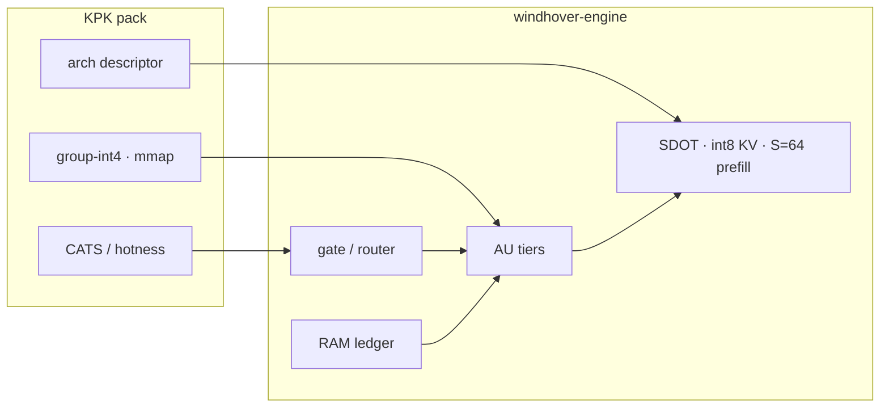
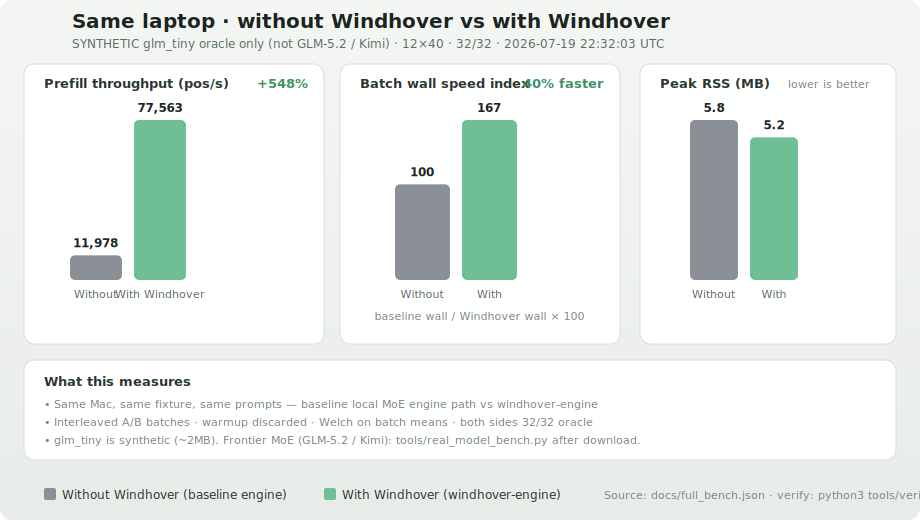
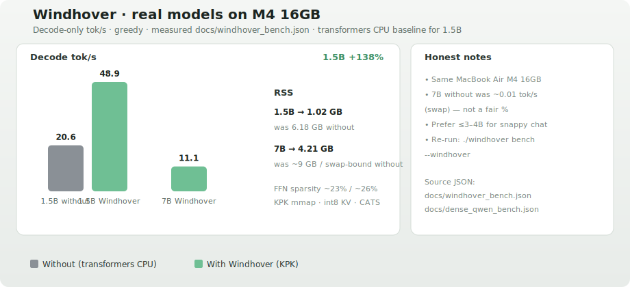

<p align="center">
  
</p>

<h1 align="center">Windhover</h1>

<p align="center">
  <strong>Local LLM runtime for macOS</strong> — sparse working-set inference on Apple Silicon.
  Library · Chat · Agent · Advanced.
</p>

<p align="center">
  <a href="#performance">Performance</a> ·
  <a href="#how-it-works">How it works</a> ·
  <a href="#mac-app">Mac app</a> ·
  <a href="#quick-start">Quick start</a> ·
  <a href="#license">License</a>
</p>

---

**Windhover** runs open models on your Mac with a hard RAM ceiling. The ship binary is **`windhover-engine`**: Mixture-of-Experts (GLM-class) and dense packs (Qwen, Llama, Mistral, Gemma, Phi) share one activation-unit (AU) budget, mmap’d KPK weights, and bandwidth-first CPU kernels.

Numerics lineage (Apache-2.0) is documented in [UPSTREAM.md](UPSTREAM.md).

---

## Screenshots

### Library

Browse Mac-16GB packs, GLM, Qwen, Kimi, DeepSeek, Mistral, and Llama. Install / uninstall locally.


### Chat

Markdown replies, streaming when enabled, and per-message speed / RSS chips.


### Advanced

Live telemetry: RSS, latency, tok/s, backend path, and Windhover decode stats (prefill, footprint, sparsity, AU hit).


---

## Performance

Measured on a **MacBook Air M4 · 16 GB · 4P+6E**. Numbers are from benches on this machine — never projected.

### Diagnosis (why Windhover exists)

- Decode is **memory-bandwidth-bound**. Stream ceiling here is ~**74–90 GB/s** (4 P-threads). A naïve dense path that still moves ~0.9 GB/token only reaches ~**40%** of that budget.
- Bytes/token blow up with fp32 KV, dense FFN every step, and load-time re-quant (RAM spikes + slow cold start).
- Bigger models fall off a cliff first (7B was swap-bound under stock `transformers` on this laptop).
- MoE already had streaming experts and grouped-int4; dense models needed the same **sparse working-set** idea.

### Idea

Treat every model as a set of **activation units** under one byte ledger:

- Dense: FFN neuron bundles (CATS magnitude gate)
- MoE: routed experts

Hot AUs stay mlocked; cold AUs stay mmap’d / SSD-backed. Kernels only touch predicted bytes.



### Phase-0 gates

[`docs/windhover_gates.json`](docs/windhover_gates.json) · harness [`tools/windhover_gates.py`](tools/windhover_gates.py)

| Gate | Result |
|---|---|
| G1 int4-g64 kernel ceiling | **PASS** (~77–91 GB/s) |
| G2 quality (PPL) | **PASS** (WH-C; CATS **25%** default) |
| G3 n-gram speculation | **opt-in only** (`WH_SPEC=1`; missed 1.25× headline bar) |
| G4 mmap residency | **PASS** |
| G5 SME2 @ S=64 | **PASS** (experimental runtime: `SME=1` + `WH_SME_RUNTIME=1`) |
| G6 SSD @ 64 KB | **PASS** (~2.9 GB/s) |

### Without Windhover vs with Windhover

Same prompts, greedy decode-only tok/s where applicable. Full dumps: [`docs/windhover_bench.json`](docs/windhover_bench.json), [`docs/dense_qwen_bench.json`](docs/dense_qwen_bench.json), [`docs/qwen7b_bench.json`](docs/qwen7b_bench.json).

#### Qwen2.5-Coder-1.5B Instruct

| | Without Windhover | With Windhover |
|---|---:|---:|
| Path | stock `transformers` · CPU · fp16 | **`windhover-engine` · KPK** |
| Decode | **20.6 tok/s** | **48.9 tok/s** |
| Peak RSS | **6.18 GB** | **1.02 GB** |
| Prefill | — | **~52 tok/s** |
| FFN sparsity | 0% | **~23%** |
| **Δ decode** | — | **+137%** |
| **Δ RSS** | — | **−83%** |

#### Qwen2.5-7B Instruct

| | Without Windhover | With Windhover |
|---|---:|---:|
| Path | stock `transformers` · CPU · fp16 | **`windhover-engine` · KPK** |
| Decode | **~0.01 tok/s** (swap-bound) | **11.1 tok/s** |
| Peak RSS | **~9.0 GB** | **4.21 GB** |
| Prefill | thrash | **~9.7 tok/s** |
| On-disk pack | ~15 GB fp16 | **~4.4 GB KPK** |
| FFN sparsity | 0% | **~26%** |
| **Δ decode** | — | swap → **usable (~11 tok/s)** |
| **Δ RSS** | — | **−53%** |

```bash
./windhover pull Qwen/Qwen2.5-Coder-1.5B-Instruct --weights
./windhover convert ~/.windhover/models/Qwen__Qwen2.5-Coder-1.5B-Instruct
./windhover build
./windhover bench --windhover
```

### Micro-fixture oracle (`glm_tiny`)

**Not a real language model** — synthetic teacher-forcing fixture for numerics only.

| Metric | Without | With Windhover | Δ |
|---|---:|---:|---:|
| Prefill throughput (pos/s) | 11 978 | 77 563 | **+548%** |
| Batch wall (s) | 0.297 | 0.178 | **−40%** |
| Oracle | 32/32 | 32/32 | match |

Dump: [`docs/full_bench.json`](docs/full_bench.json). Chart: [`docs/screenshots/bench-without-vs-with-windhover.svg`](docs/screenshots/bench-without-vs-with-windhover.svg).



### Real-model decode (M4 16GB)



### Frontier MoEs

GLM-5.2 / Kimi-class packs need full HF download (~600–756 GB) + convert. **No invented tok/s** until measured. Status: [`docs/real_model_bench.json`](docs/real_model_bench.json).

---

## How it works

```text
┌─────────────┐     ┌──────────────┐     ┌───────────────────┐
│  Mac app /  │────▶│  ./windhover │────▶│  windhover-engine │
│  Library UI │     │  app :8000   │     │  SNAP=model dir   │
└─────────────┘     └──────────────┘     └───────────────────┘
                           │
                           ├─ /v1/catalog
                           ├─ /api/pull · /api/uninstall
                           ├─ /v1/chat/...
                           ├─ /api/workspace · /api/agent
                           └─ /api/stats
```

1. **Library** — Mac 16GB packs convert to KPK and run on `windhover-engine`; frontier MoEs after real download + convert.
2. **Chat** — only chat-capable installs; no silent model swap.
3. **Agent** — folder-scoped list/read/write on device.
4. **Advanced** — live RSS, tok/s, Windhover sparsity / footprint / AU hit.
5. **RAM ceiling** — `RAM_GB` / hard-cap ledger.

---

## Mac app

Bundle ID: `ai.vexilo.windhover`

```bash
./windhover build
cd app && npm ci && npm run build && cd ..
cd desktop && cargo tauri build --bundles app,dmg
open desktop/src-tauri/target/release/bundle/macos/Windhover.app
```

Dev: `cd desktop && cargo tauri dev` (starts or reuses `./windhover app` on `:8000`).

See [`desktop/README.md`](desktop/README.md).

---

## Quick start

```bash
git clone <repo> && cd Kestrel   # repo folder name may still be Kestrel
./windhover build
./windhover oracle
./windhover pull windhover/glm-tiny-demo
./windhover app                 # http://127.0.0.1:8000
```

```bash
./windhover pull Qwen/Qwen2.5-Coder-1.5B-Instruct --weights
./windhover convert ~/.windhover/models/Qwen__Qwen2.5-Coder-1.5B-Instruct
./windhover chat --model ~/.windhover/models/Qwen__Qwen2.5-Coder-1.5B-Instruct/kpk \
  --prompt "Hello" --ngen 64
```

```bash
./windhover bench --windhover
./windhover bench --smoke
./windhover uninstall Qwen/Qwen2.5-Coder-1.5B-Instruct
```

(`./kestrel` remains a thin shim to `./windhover`.)

Model home: `~/.windhover/models` (falls back to `~/.kestrel/models` if present).

---

## Layout

| Path | Role |
|------|------|
| [`engine/`](engine/) | **`windhover-engine`** (MoE + dense KPK) |
| [`engine/runtime/windhover.c`](engine/runtime/windhover.c) | Dense Windhover runtime |
| [`tools/kestrel_pack.py`](tools/kestrel_pack.py) | HF → KPK converter |
| [`windhover`](windhover) | CLI + Library/Chat API |
| [`app/`](app/) | Vite/React UI |
| [`desktop/`](desktop/) | Tauri macOS app |
| [`docs/`](docs/) | Benches and notes |
| [`UPSTREAM.md`](UPSTREAM.md) | License / numerics lineage |

---

## Models

Catalog (`app/public/catalog.json`):

- **Mac 16GB** — SmolLM2, Qwen2.5 / Qwen3 small, TinyLlama, Phi-3.5, Gemma 2, R1-distill  
- **GLM / Qwen / Kimi / DeepSeek / Mistral / Llama** frontier entries (honest download sizes)

Install is honest: small models download real HF weights; frontier MoEs require explicit **Download weights**.

---

## Requirements

- macOS 12+ (Apple Silicon recommended)  
- Xcode CLT, Rust (Tauri), Node 18+  
- Python 3.10+ with `torch` + `transformers` for preview (`c/.venv`)  
- Optional: Hugging Face CLI for `--weights` pulls  

---

## License

Apache-2.0 — see [LICENSE](LICENSE). Upstream attribution in [UPSTREAM.md](UPSTREAM.md).

---

## Star history

<p align="center">
  <a href="https://star-history.com/#cliclye/Kestrel&Date">
    
  </a>
</p>
