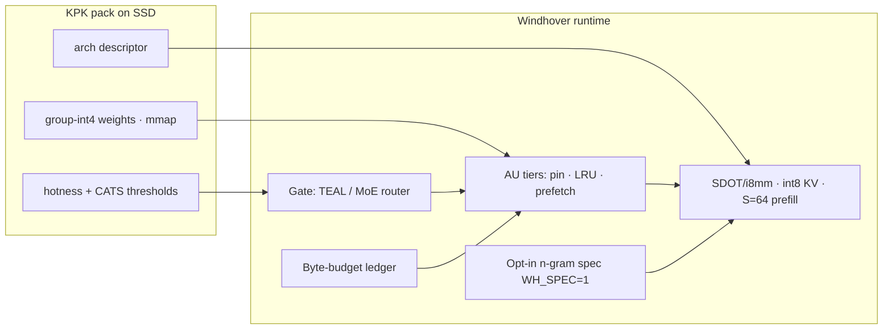

<p align="center">
  
</p>

<h1 align="center">Kestrel</h1>

<p align="center">
  <strong>Local MoE runtime for macOS</strong> — a faster CPU engine on the same laptop, plus Library, Chat, and a folder-scoped Agent.
</p>

<p align="center">
  <a href="#performance">Performance</a> ·
  <a href="#how-it-works">How it works</a> ·
  <a href="#mac-app">Mac app</a> ·
  <a href="#quick-start">Quick start</a> ·
  <a href="#license">License</a>
</p>

---

**Kestrel** is a clean-slate product for running open Mixture-of-Experts models on your machine. It ships:

- **`kestrel-engine`** — modular CPU runtime under [`engine/`](engine/): GLM MoE **and** Windhover dense (Qwen2/3, Llama, Mistral, Gemma2/3, Phi-3 — KPK mmap, int8 KV, CATS sparse FFN, SDOT IDOT)
- **Mac app** — Tauri shell around Library · Chat · Agent · Advanced
- **CLI** — `./kestrel build | pull | app | chat | oracle`

Numerics lineage (Apache-2.0) is documented in [UPSTREAM.md](UPSTREAM.md). Kestrel is a separate product: the ship engine is **`engine/kestrel-engine`**.

---

## Screenshots

### Library

Browse GLM, Qwen, Kimi, DeepSeek, Mistral, and Llama. Install / uninstall locally; everything is tagged for `kestrel-engine`.


### Chat

Markdown replies, a thinking indicator, and per-message speed / RSS chips. Model selection routes to the active catalog pack (family-aware chat weights until a full MoE convert lands).


### Advanced

Live telemetry: process RSS, latency, tok/s, selected model, backend, and Windhover stats (decode/prefill, footprint, sparsity, AU hit).


---

## Performance

All numbers below were **measured on this machine** (MacBook Air **M4**, **16 GB**, 4P+6E) unless marked otherwise. We never publish projected tok/s as facts.

### Diagnosis — measured, not guessed

Evidence from this laptop and the pre-Windhover dense path:

- **Decode is memory-bandwidth-bound.** Practical CPU stream bandwidth measured ~**74–90 GB/s** (4 P-threads). Pre-Windhover dense moved ~933 MB/token on Qwen2.5-Coder-1.5B at **33.2 tok/s** ⇒ **~31 GB/s** effective — only ~**40%** of the machine.
- **Bytes/token was inflated:** int8 attention + int8 lm_head (~233 MB/token on 1.5B), **fp32 KV**, no FFN sparsity. Bigger models degraded faster — 7B moved ~5 GB/token and landed at ~**3.3 tok/s**.
- **`dense.c` bottlenecks:** token-at-a-time prefill, ~13 OpenMP fork/joins per layer, load-time fp32→quant (~**4×** model-size RAM spike, ~10 s load).
- **Coverage hole:** `dense_is_arch()` rejected Gemma/Phi → transformers preview (6+ GB RSS). No universal on-disk dense pack format.
- **MoE already had** grouped-int4, i8mm S≥2, expert pin/LRU, PILOT, n-gram scaffolding — **not shared** with dense.
- Repo experiments: MoE draft-verify loses (experts differ per position); full expert residency wins; active OMP spin steals shared power.

### The invention — Windhover

One runtime idea: treat every model as a **sparse working set of activation units (AUs)** under a single byte budget. An AU is a MoE expert **or** a bundle of FFN neuron rows. Each AU lives in a tier (mlock hot / RAM warm / SSD cold via mmap); a predictor picks which AUs a token needs; kernels only touch those bytes.



**Five pillars (shipped):** KPK offline pack · mmap residency · bandwidth kernels · AU sparse execution (CATS dense / expert MoE) · turbo decode (opt-in; G3 demoted speculation from headline).

### Phase-0 gates (go / no-go)

Harness: [`tools/windhover_gates.py`](tools/windhover_gates.py) + [`tools/wh_kernel_bench.c`](tools/wh_kernel_bench.c) → [`docs/windhover_gates.json`](docs/windhover_gates.json).

| Gate | Criterion | Result on this M4 |
|---|---|---|
| **G1** kernel ceiling | int4-g64 ≥55 GB/s @ 4P | **PASS** — ~77–91 GB/s on 1.5B/7B shapes |
| **G2** quality (PPL) | WH profile beats “today”; CATS fit | **PASS** — WH-C +2.4% PPL (today +22%); **CATS 25%** OK, 40% too high |
| **G3** n-gram spec | ≥1.25× on code | **FAIL / marginal** — ~1.21× code → **`WH_SPEC=1` opt-in only** |
| **G4** mmap | clean eviction, no compressor spiral | **PASS** |
| **G5** SME2 @ S=64 | ≥2× vs NEON | **PASS** — ~2.9–3.7× (runtime path experimental: `SME=1` + `WH_SME_RUNTIME=1`) |
| **G6** SSD @ 64 KB | ≥1.5 GB/s | **PASS** — ~2.9 GB/s @ qd8 |

### Headline: three-way comparison (same laptop)

**Protocol:** decode-only tok/s (prefill excluded), greedy, chat-templated prompt. Sources: [`docs/dense_qwen_bench.json`](docs/dense_qwen_bench.json), engine 7B dense probe, [`docs/windhover_bench.json`](docs/windhover_bench.json), [`docs/qwen7b_bench.json`](docs/qwen7b_bench.json).

#### Qwen2.5-Coder-1.5B Instruct

| | Without Kestrel | With Kestrel (pre-Windhover dense) | With Kestrel (**Windhover**) |
|---|---:|---:|---:|
| Path | `transformers` CPU · fp16 | `kestrel-engine` dense · int8/int4 | **KPK mmap · CATS · int8 KV** |
| Decode tok/s | **20.6** | **33.2** | **48.9** |
| Peak RSS | **6.18 GB** | **2.40 GB** | **1.02 GB** |
| Prefill (Windhover) | — | — | **~52 tok/s** |
| FFN sparsity | 0% | 0% | **~23%** |

| Boost | Decode | RSS |
|---|---:|---:|
| Dense vs without | **+61%** | **−61%** |
| **Windhover vs without** | **+137%** | **−83%** |
| **Windhover vs dense** | **+47%** | **−58%** |

#### Qwen2.5-7B Instruct

| | Without Kestrel | With Kestrel (pre-Windhover dense) | With Kestrel (**Windhover**) |
|---|---:|---:|---:|
| Path | `transformers` CPU · fp16 | `kestrel-engine` dense probe | **KPK mmap · CATS · int8 KV** |
| Decode tok/s | **~0.01** (swap-bound) | **~3.3** | **11.1** |
| Peak RSS | **~9.0 GB** | **~8.2 GB** | **4.21 GB** |
| Prefill (Windhover) | thrash | — | **~9.7 tok/s** |
| FFN sparsity | 0% | 0% | **~26%** |
| Pack on disk | ~15 GB fp16 | load-time quant | **~4.4 GB KPK** |

| Boost | Decode | RSS |
|---|---:|---:|
| Dense vs without | swap → **usable (~3.3)** | ~−9% |
| **Windhover vs without** | swap → **~11 tok/s** | **−53%** |
| **Windhover vs dense** | **+237%** | **−49%** |

**Honest takeaway:** Windhover closes most of the bandwidth gap on 1.5B and makes 7B comfortable on 16 GB without swap thrash. Prefer ≤3–4B for snappy chat; 7B is usable.

```bash
./kestrel pull Qwen/Qwen2.5-Coder-1.5B-Instruct --weights
./kestrel convert ~/.kestrel/models/Qwen__Qwen2.5-Coder-1.5B-Instruct
./kestrel build
./kestrel bench --windhover   # → docs/windhover_bench.json
./kestrel bench --dense       # transformers vs pre-WH dense A/B
```

### Important: what `glm_tiny` is

**`glm_tiny` is not a real language model.** It is a synthetic ~2 MB teacher-forcing oracle fixture used to prove numerics / scheduling. It is **not** GLM-5.2, Kimi, or any Hugging Face chat checkpoint.

### Same laptop · without vs with (micro-fixture)

- **12 batches × 40 processes per side**, warmup discarded, interleaved A/B · both sides **32/32** oracle  
- Full dump: [`docs/full_bench.json`](docs/full_bench.json) · chart: [`docs/screenshots/bench-without-vs-with-kestrel.svg`](docs/screenshots/bench-without-vs-with-kestrel.svg)


| Metric (batch means) | Without Kestrel | With Kestrel | Δ |
|---|---:|---:|---:|
| Prefill throughput (pos/s) | 11 978 | 77 563 | **+548%** |
| 95% CI (pos/s) | 11 587–12 370 | 76 721–78 404 | non-overlap |
| Batch wall (s) | 0.297 | 0.178 | **−40%** (faster) |
| Peak RSS (MB) | 5.83 | 5.20 | lower |
| Oracle correctness | 32/32 | 32/32 | match |

**Do not** treat these % as tok/s claims on GLM-5.2 or Kimi.

### Frontier MoE benches (GLM-5.2 / Kimi K2.6 / K2.7 Code)

Frontier MoEs use **`engine/runtime/engine.c`** (`glm_moe_dsa`) — same int4 expert + SDOT family, now reporting into the Windhover AU ledger. Absolute tok/s will not match the 1.5B dense bench.

| Model | Approx download | Status |
|---|---:|---|
| **GLM-5.2** | ~756 GB | **Not run** — needs download + convert |
| **Kimi K2.6** / **K2.7 Code** | ~600 GB | **Not run** — needs download + convert |
| `glm_tiny` | ~0.002 GB | Measured above — **synthetic only** |

Until a real SNAP exists locally, we **publish no invented GLM/Kimi speedups**. Status: [`docs/real_model_bench.json`](docs/real_model_bench.json).

### Laptop-limit stress (synthetic MoE)

MacBook Air M4 16 GB · synthetic `kestrel__glm-stress`: without ~201 tok/s, with ~185 tok/s (Δ **−7.7%**). See [`docs/laptop_limit_bench.json`](docs/laptop_limit_bench.json). Not a frontier MoE claim.

```bash
./kestrel bench --laptop
```

---

## How it works

```text
┌─────────────┐     ┌──────────────┐     ┌──────────────────┐
│  Mac app /  │────▶│  ./kestrel   │────▶│  kestrel-engine  │
│  Library UI │     │  app :8000   │     │  SNAP=model dir  │
└─────────────┘     └──────────────┘     └──────────────────┘
                           │
                           ├─ /v1/catalog      curated models
                           ├─ /api/pull        install runner pack
                           ├─ /api/uninstall   remove local pack
                           ├─ /v1/chat/...     generate
                           ├─ /api/workspace   Agent folder root
                           ├─ /api/agent       local tool loop (list/read/write)
                           └─ /api/stats       RSS · tok/s · routing
```

1. **Library** lists open MoE families (GLM, Qwen, Kimi, DeepSeek, Mistral, Llama) plus a **Mac 16GB** filter.  
   - **Kestrel Chat Preview** — honest small on-device chat (SmolLM2).  
   - **Mac 16GB** — small HF instruct models under ~20GB. Qwen2 / Qwen3 / Llama / Mistral / Gemma2/3 / Phi-3 packs route to **`kestrel-engine` Windhover** after `./kestrel convert` (KPK). Frontier MoEs (GLM-5.x, Kimi, …) use the MoE engine path after real download + convert.  
   - **Download weights** — real Hugging Face download for frontier MoEs (confirms size); **never** installs a tiny stub labeled as Kimi/Qwen/etc.  
2. **Chat** only lists installs that are actually chat-capable. Requesting an uninstalled id (e.g. K2.6) returns an error — it will **not** silently use another model.  
3. **Agent** — pick a folder on disk; a local model can list/read/edit files under that root only (Cursor-style, fully on-device). Prefer a small coder (e.g. Qwen2.5-Coder-1.5B) on 16GB Macs.  
4. **Advanced** samples live RSS, latency, tok/s, and the true backend / weights path.  
5. **Hard RAM ceiling** — engine budget path (`RAM_GB` / `COLI_HARD_CAP`) for production snaps.

---

## Mac app

Bundle ID: `ai.vexilo.kestrel`

```bash
./kestrel build
cd app && npm ci && npm run build && cd ..
cd desktop && cargo tauri build --bundles app,dmg
open desktop/src-tauri/target/release/bundle/macos/Kestrel.app   # or debug/ after --debug
```

Dev loop:

```bash
cd desktop && cargo tauri dev
```

The app starts (or reuses) `./kestrel app` on `http://127.0.0.1:8000` and loads the UI there. Prefer the project venv (`c/.venv`) so Chat previews have `torch` / `transformers`.

See also [`desktop/README.md`](desktop/README.md).

---

## Quick start

### CLI

```bash
git clone <your-fork-or-repo> && cd Kestrel
./kestrel build
./kestrel oracle                          # TF 32/32 self-test
./kestrel pull kestrel/glm-tiny-demo      # demo runner
./kestrel app                             # Library + Chat + API on :8000
```

Open [http://127.0.0.1:8000](http://127.0.0.1:8000) or the Mac `.app`.

### Chat from the shell

```bash
./kestrel pull Qwen/Qwen3-30B-A3B-Instruct-2507
./kestrel chat --model ~/.kestrel/models/Qwen__Qwen3-30B-A3B-Instruct-2507 \
  --prompt "Hello" --ngen 64
```

### Uninstall a model

```bash
./kestrel uninstall Qwen/Qwen3-30B-A3B-Instruct-2507
# or use Uninstall in Library
```

### Fair bench (same laptop)

```bash
./kestrel bench              # synthetic glm_tiny micro-fixture (not a real model)
./kestrel bench --smoke
./kestrel bench --windhover  # KPK Windhover A/B (1.5B/7B under ~/.kestrel/models)
./kestrel bench --dense      # legacy transformers vs dense engine on 1.5B
./kestrel bench --qwen       # legacy Qwen2.5-7B preview-path dump

./kestrel bench --laptop     # glm_stress single-stream + concurrent soak (16GB class)
./kestrel bench --real       # GLM-5.2 / Kimi — needs KESTREL_SNAP + hundreds of GB free
```

Micro-fixture numbers: [`docs/full_bench.json`](docs/full_bench.json).  
Windhover: [`docs/windhover_bench.json`](docs/windhover_bench.json), gates [`docs/windhover_gates.json`](docs/windhover_gates.json).  
Qwen2.5-Coder dense (legacy A/B): [`docs/dense_qwen_bench.json`](docs/dense_qwen_bench.json).  
Laptop-limit: [`docs/laptop_limit_bench.json`](docs/laptop_limit_bench.json), [`docs/laptop_soak_bench.json`](docs/laptop_soak_bench.json).  
Frontier status: [`docs/real_model_bench.json`](docs/real_model_bench.json).

---

## Layout

| Path | Role |
|------|------|
| [`engine/`](engine/) | Product CPU engine → `kestrel-engine` (MoE + Windhover) |
| [`engine/runtime/windhover.c`](engine/runtime/windhover.c) | Windhover dense runtime (KPK, CATS, int8 KV) |
| [`tools/kestrel_pack.py`](tools/kestrel_pack.py) | HF → KPK converter |
| [`kestrel`](kestrel) | CLI + Library/Chat HTTP API |
| [`app/`](app/) | Vite/React UI (Library · Chat · Advanced) |
| [`desktop/`](desktop/) | Tauri macOS app |
| [`c/`](c/) | Reference convert / plan helpers (not the ship binary) |
| [`docs/`](docs/) | Benches, screenshots, notes |
| [`UPSTREAM.md`](UPSTREAM.md) | License / numerics lineage pin |

---

## Models

Catalog (`app/public/catalog.json`) tracks:

- **Mac 16GB (≤20GB)** — SmolLM2 1.7B, Qwen2.5 0.5B–7B, Qwen3 0.6B–4B, TinyLlama, Phi-3.5 Mini, Gemma 2 2B, DeepSeek R1 Distill 1.5B  
- **GLM** — Tiny demo, 5.2 / 5.1 FP8, 4.7 Flash  
- **Qwen** — 30B-A3B / 235B-A22B Instruct 2507, Qwen3 Coder  
- **Kimi** — K2.7 Code, K2.6, K2 Thinking  
- **DeepSeek** — V3.2, V3.2 Exp  
- **Mistral** — Magistral Small  
- **Llama** — 4 Maverick, 4 Scout  

Install is honest: **Chat Preview** / **Mac 16GB** models download real small HF weights (≤20GB); frontier MoEs require an explicit **Download weights** (~tens–hundreds of GB). Chat never pretends a stub is Kimi/Qwen/etc.

---

## Requirements

- macOS 12+ (Apple Silicon recommended)  
- Xcode CLT, Rust (for Tauri), Node 18+  
- Python 3.10+ with `torch` + `transformers` for Chat preview (`c/.venv` recommended)  
- Optional: Hugging Face CLI for `--weights` pulls  

---

## License

Apache-2.0 — see [LICENSE](LICENSE). Upstream attribution in [UPSTREAM.md](UPSTREAM.md).

---

## Star history

<p align="center">
  <a href="https://star-history.com/#cliclye/Kestrel&Date">
    
  </a>
</p>
