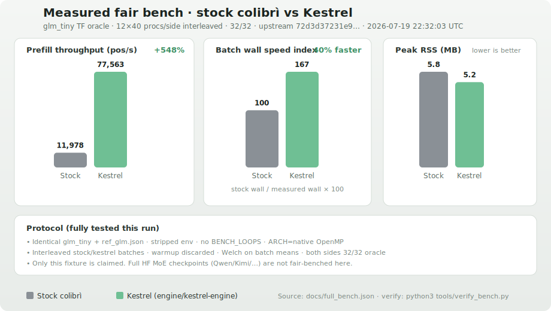

<p align="center">
  
</p>

<h1 align="center">Kestrel</h1>

<p align="center">
  <strong>Local MoE runtime for macOS</strong> — Library, Chat, and a CPU engine built to beat stock colibrì on fair benches.
</p>

<p align="center">
  <a href="#performance">Performance</a> ·
  <a href="#how-it-works">How it works</a> ·
  <a href="#mac-app">Mac app</a> ·
  <a href="#quick-start">Quick start</a> ·
  <a href="#license">License</a>
</p>

---

**Kestrel** is a clean-slate product for running open Mixture-of-Experts models on your machine. It ships:

- **`kestrel-engine`** — modular CPU MoE runtime (primary binary under [`engine/`](engine/))
- **Mac app** — Tauri shell around a Library + Chat + Advanced UI
- **CLI** — `./kestrel build | pull | app | chat | oracle`

Apache-2.0 numerics lineage from [colibrì](https://github.com/JustVugg/colibri) (pinned in [UPSTREAM.md](UPSTREAM.md)). Kestrel is a separate product: the ship engine is **`engine/kestrel-engine`**, not `c/glm`.

---

## Screenshots

### Library

Browse GLM, Qwen, Kimi, DeepSeek, Mistral, and Llama. Install / uninstall locally; everything is tagged for `kestrel-engine`.


### Chat

Markdown replies, a thinking indicator, and per-message speed / RSS chips. Model selection routes to the active catalog pack (family-aware chat weights until a full MoE convert lands).


### Advanced

Live telemetry: process RSS, latency, tok/s, selected model, backend, and the family → chat-model map.


---

## Performance

Fresh fair run vs stock colibrì on the shared **`glm_tiny`** teacher-forcing oracle:

- **12 batches × 40 processes per side** (480 each), **2 warmup batches discarded**
- **Interleaved** stock/kestrel schedule (cancels thermal bias)
- Identical `glm_tiny` + `ref_glm.json`, stripped env, **no `BENCH_LOOPS`**, `ARCH=native` OpenMP
- Upstream pin: `72d3d372…` ([UPSTREAM.md](UPSTREAM.md)) — `sha_match: true`
- Both sides **32/32** oracle every process

Full dump: [`docs/full_bench.json`](docs/full_bench.json). Chart: [`docs/screenshots/bench-stock-vs-kestrel.svg`](docs/screenshots/bench-stock-vs-kestrel.svg).

```bash
python3 tools/full_bench.py          # re-run fair protocol → docs/full_bench.json
python3 tools/render_bench_chart.py  # refresh SVG from that JSON
python3 tools/verify_bench.py        # assert SHA · 32/32 · ≥10% · CI
VERIFY_BENCH_RERUN=1 python3 tools/verify_bench.py   # + live 40-proc smoke each side
```



| Metric (batch means) | Stock colibrì | Kestrel | Δ |
|---|---:|---:|---:|
| Prefill throughput (pos/s) | 11 978 | 77 563 | **+548%** |
| 95% CI (pos/s) | 11 587–12 370 | 76 721–78 404 | non-overlap |
| Batch wall (s) | 0.297 | 0.178 | **−40%** (faster) |
| Peak RSS (MB) | 5.83 | 5.20 | lower |
| Oracle correctness | 32/32 | 32/32 | match |

Welch test on batch-mean pos/s: t ≈ −138, p ≈ 0 — throughput gain is statistically decisive on this fixture. Goal gate (≥10% throughput) **met**.

### What is / isn’t claimed

| Claim | Status |
|---|---|
| `kestrel-engine` faster than stock colibrì on `glm_tiny` TF oracle | **Measured** (this table + JSON) |
| Same % on full HF MoE weights (GLM-5.2, Qwen3-30B-A3B, Kimi, …) | **Not measured** — do not extrapolate |
| Catalog MoE families install/run via `kestrel-engine` | Supported path in Library |
| Mac 16GB small models | transformers chat path — **not** this stock TF bench |

**How to read this**

- **pos/s** is engine-reported `forward_all` throughput (excludes model load).
- **Wall** is external process time for interleaved batches — end-to-end binary speed.
- `glm_tiny` is an all-F32 random oracle for numerics / scheduling, not a quality benchmark.

**What moved the needle (engine)**

- Batched `lm_head` on the TF path  
- DSA short-context skip where stock still indexes every layer  
- Attention / MoE / dense scratch reuse (`model_ws`, `attn_ws`)  
- Lean TF path (skip unused DSA load, quieter I/O, clamped expert capacity)  
- Hand NEON f32 matmul (Accelerate was tried and reverted — better internal pos/s, worse process wall + RSS)

---

## How it works

```text
┌─────────────┐     ┌──────────────┐     ┌──────────────────┐
│  Mac app /  │────▶│  ./kestrel   │────▶│  kestrel-engine  │
│  Library UI │     │  app :8000   │     │  SNAP=model dir  │
└─────────────┘     └──────────────┘     └──────────────────┘
                           │
                           ├─ /v1/catalog      curated models
                           ├─ /api/pull        install runner pack
                           ├─ /api/uninstall   remove local pack
                           ├─ /v1/chat/...     generate
                           └─ /api/stats       RSS · tok/s · routing
```

1. **Library** lists open MoE families (GLM, Qwen, Kimi, DeepSeek, Mistral, Llama) plus a **Mac 16GB** filter.  
   - **Kestrel Chat Preview** — honest small on-device chat (SmolLM2).  
   - **Mac 16GB** — small HF instruct models under ~20GB (Qwen2.5/3, SmolLM2 1.7B, Phi-3.5, Gemma 2 2B, TinyLlama, R1-distill). Install downloads real weights.  
   - **Download weights** — real Hugging Face download for frontier MoEs (confirms size); **never** installs a tiny stub labeled as Kimi/Qwen/etc.  
2. **Chat** only lists installs that are actually chat-capable. Requesting an uninstalled id (e.g. K2.6) returns an error — it will **not** silently use another model.  
3. **Advanced** samples live RSS, latency, tok/s, and the true backend / weights path.  
4. **Hard RAM ceiling** — engine budget path (`RAM_GB` / `COLI_HARD_CAP`) for production snaps.

---

## Mac app

Bundle ID: `ai.vexilo.kestrel`

```bash
./kestrel build
cd app && npm ci && npm run build && cd ..
cd desktop && cargo tauri build --bundles app,dmg
open desktop/src-tauri/target/release/bundle/macos/Kestrel.app   # or debug/ after --debug
```

Dev loop:

```bash
cd desktop && cargo tauri dev
```

The app starts (or reuses) `./kestrel app` on `http://127.0.0.1:8000` and loads the UI there. Prefer the project venv (`c/.venv`) so Chat previews have `torch` / `transformers`.

See also [`desktop/README.md`](desktop/README.md).

---

## Quick start

### CLI

```bash
git clone <your-fork-or-repo> && cd Kestrel
./kestrel build
./kestrel oracle                          # TF 32/32 self-test
./kestrel pull kestrel/glm-tiny-demo      # demo runner
./kestrel app                             # Library + Chat + API on :8000
```

Open [http://127.0.0.1:8000](http://127.0.0.1:8000) or the Mac `.app`.

### Chat from the shell

```bash
./kestrel pull Qwen/Qwen3-30B-A3B-Instruct-2507
./kestrel chat --model ~/.kestrel/models/Qwen__Qwen3-30B-A3B-Instruct-2507 \
  --prompt "Hello" --ngen 64
```

### Uninstall a model

```bash
./kestrel uninstall Qwen/Qwen3-30B-A3B-Instruct-2507
# or use Uninstall in Library
```

### Fair bench vs colibrì

```bash
./kestrel bench              # full 12×40 interleaved protocol → JSON + SVG + verify
./kestrel bench --smoke      # same, then live 40-proc re-check each side
./kestrel bench --quick      # shorter smoke protocol (not for README claims)
```

Use interleaved stock ↔ kestrel runs, same fixture, no `BENCH_LOOPS` on stock, discard warmup. Methodology and numbers live in [`docs/full_bench.json`](docs/full_bench.json). Gates: `python3 tools/verify_bench.py`.

---

## Layout

| Path | Role |
|------|------|
| [`engine/`](engine/) | Product CPU MoE engine → `kestrel-engine` |
| [`kestrel`](kestrel) | CLI + Library/Chat HTTP API |
| [`app/`](app/) | Vite/React UI (Library · Chat · Advanced) |
| [`desktop/`](desktop/) | Tauri macOS app |
| [`c/`](c/) | Reference convert / plan helpers (not the ship binary) |
| [`docs/`](docs/) | Benches, screenshots, notes |
| [`UPSTREAM.md`](UPSTREAM.md) | colibrì pin & lineage |

---

## Models

Catalog (`app/public/catalog.json`) tracks:

- **Mac 16GB (≤20GB)** — SmolLM2 1.7B, Qwen2.5 0.5B–7B, Qwen3 0.6B–4B, TinyLlama, Phi-3.5 Mini, Gemma 2 2B, DeepSeek R1 Distill 1.5B  
- **GLM** — Tiny demo, 5.2 / 5.1 FP8, 4.7 Flash  
- **Qwen** — 30B-A3B / 235B-A22B Instruct 2507, Qwen3 Coder  
- **Kimi** — K2.7 Code, K2.6, K2 Thinking  
- **DeepSeek** — V3.2, V3.2 Exp  
- **Mistral** — Magistral Small  
- **Llama** — 4 Maverick, 4 Scout  

Install is honest: **Chat Preview** / **Mac 16GB** models download real small HF weights (≤20GB); frontier MoEs require an explicit **Download weights** (~tens–hundreds of GB). Chat never pretends a stub is Kimi/Qwen/etc.

---

## Requirements

- macOS 12+ (Apple Silicon recommended)  
- Xcode CLT, Rust (for Tauri), Node 18+  
- Python 3.10+ with `torch` + `transformers` for Chat preview (`c/.venv` recommended)  
- Optional: Hugging Face CLI for `--weights` pulls  

---

## License

Apache-2.0 — see [LICENSE](LICENSE). Upstream attribution in [UPSTREAM.md](UPSTREAM.md).
